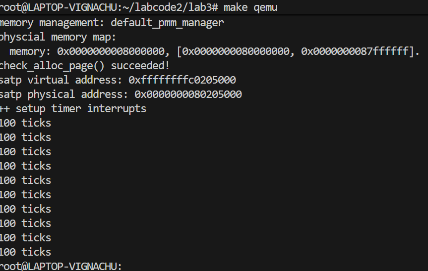
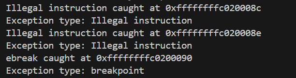

# Lab3实验报告:终端与中断处理流程

## 练习1:完善中断处理 


### 1. 实验目的

本次实验旨在完善内核中对“RISC-V 平台监管者模式定时器中断（IRQ_S_TIMER）”的处理，以实现一个简单的、基于计数的系统关机机制。具体要求是：每接收到 100 次时钟中断，打印一行 “100 ticks”，在累计打印 10 行后，调用 SBI 接口安全关机。

### 2.实现逻辑

所有修改主要集中在 `kern/trap/trap.c` 文件`interrupt_handler` 函数 `case IRQ_S_TIMER:` 分支内。

- 首先调用 clock_set_next_event() 重新设置定时器以确保下一次中断能被周期性触发。
- 接着将全局计数器 ticks 加一。
- 然后检查 ticks是否达到 100 的倍数；如果达到，则打印 “100 ticks” 并递增打印计数器 num_prints。
- 最后当 num_prints 达到 10 次的预设值时，代码将调用 sbi_shutdown() 通过 SBI 接口安全关闭系统。


核心代码段的实现和分析如下：

| **代码行** | **实现功能** | **逻辑分析与必要性** |
| :--- | :--- | :--- |
| `clock_set_next_event();` | 设置下一次定时器中断 | **关键步骤：** RISC-V 架构下，定时器中断是单次的。在处理完当前中断后，必须调用此函数来重置 CPU 的 `mtimecmp` 寄存器。若不设置，定时器将不再触发。此函数同时清除 `sip` 寄存器中的 STIP 位。 |
| `extern volatile size_t ticks;` | 声明外部全局计数器 | `extern` 表明 `ticks` 变量定义在其他文件（如 `clock.c`）。`volatile` 关键字是必要的，因为它告诉编译器 `ticks` 的值可能会在程序控制流之外（即由中断服务例程）被异步修改，从而阻止编译器对该变量的读取进行激进优化。 |
| `static int num_prints = 0;` | 静态局部变量，记录打印次数 | `static` 确保 `num_prints` 的值在每次 `interrupt_handler` 调用结束后仍然保留，实现了打印次数的持久化计数。它记录了“100 ticks”被输出的次数。 |
| `ticks++;` | 总中断计数加一 | 简单地记录系统接收到的总时钟中断次数。 |
| `if (ticks % TICK_NUM == 0)` | 判断是否达到 100 次中断 | `TICK_NUM` 定义为 100。该判断语句用于确定是否达到输出和增加打印计数的阈值。 |
| `if (num_prints >= 10)` | 判断是否达到关机条件 | 当满足 10 次 “100 ticks” 的输出（即总计 1000 次中断）时，触发系统关机流程。 |
| `sbi_shutdown();` | 调用 SBI 关机服务 | **特权操作：** 内核（S 模式）无法直接控制硬件关机。`sbi_shutdown()` 是通过 SBI 接口向底层 M 模式固件（如 OpenSBI）发出的服务调用，请求其执行关机操作。 |

### 3.代码展示
```C
case IRQ_S_TIMER:
            clock_set_next_event(); 
            // 设置下一次定时器事件。
            extern volatile size_t ticks; 
            // 引入全局时钟计数器，volatile确保正确访问。
            static int num_prints = 0; 
            // 静态计数器，记录 "100 ticks" 的打印次数。
            ticks++; // 总中断计数加一。
            if (ticks % TICK_NUM == 0) { 
                // 每100次中断执行一次周期性任务。
                // 调用辅助函数打印 "100 ticks" 消息
                print_ticks(); // 打印 "100 ticks"。
                // 打印次数计数器递增
                num_prints++; // 打印次数加一。
                // 检查关机条件：判断打印次数是否达到10次。
                if (num_prints >= 10) { 
                    sbi_shutdown(); // 通过 SBI 调用关机服务，安全关机。
                }
            }
            break;

```

### 4.结果展示



## Challenge1 · 描述与理解中断流程

### 1）从“异常/中断产生”到“返回原程序”的整条链路

**触发点**  
- 异步中断：时钟、外设等发来“中断”。  
- 同步异常：正在执行的指令出错（非法指令、访存异常），或主动 `ecall`。  

**硬件自动做的事**  
1. 把被打断处的 PC 地址记到 `sepc`。  
2. 把“原因”写入 `scause`（最高位=1 表示中断，0 表示异常）。  
3. 把“与异常相关的附加信息”写入 `stval`（如异常地址）。  
4. 采用Direct模式，初始化stvec寄存器。  
   > `stvec` 在初始化时被设置到 `__alltraps`，直接指向唯一的中断处理程序入口点。  

**入口汇编 `__alltraps` 做的事**  
1. `SAVE_ALL`：在栈上**按固定布局**压出一个 `trapframe`结构体，把 32 个通用寄存器 + 四个 CSR（`sstatus/sepc/stval/scause`）保存好。  
2. `mv a0, sp`：把“当前栈顶”——也就是 **`trapframe` 的地址**——放到 `a0`，a0寄存器传递参数给接下来调用的函数trap。 
3. `jal trap`：转到 `trap.c `的 `trap(struct trapframe *tf)`，且trap函数执行完之后，会回到这里向下继续执行。

**中断处理函数 `trap()` 的分发**  
- 先看 `tf->cause` 的最高位：是中断就走 `interrupt_handler`，否则走 `exception_handler`；  
- 执行时钟中断对应的处理语句，累加计数器，设置下一次时钟中断。 

**返回路径**  
1. 从`trap.c `返回后，回到汇编的 `__trapret`；  
2. `RESTORE_ALL`：按**和保存时对称的顺序**把寄存器与关键 CSR（`sstatus/sepc`）恢复；  
3. 执行 `sret`：根据sstatus.SPP的值（此时为 0）切换回 U 模式;把 `sepc` 的值赋给 `pc`，并跳转回用户程序（sepc指向的地址）继续执行。


### 2）`mv a0, sp` 的目的（为什么要把 `sp` 赋给 `a0`）

- RISC-V 约定：**函数第 1 个参数**放在 `a0`寄存器。  
- 在 `SAVE_ALL` 之后，**`sp` 正好指向我们刚压好的 `trapframe`** 结构体。  
- 把 `sp` 传给 `a0`，就是把“这块 `trapframe` 的地址”传给 C 函数 `trap(struct trapframe *tf)`，方便 C 代码直接通过 `tf->...` 访问/修改保存的上下文（比如 `tf->epc`、`tf->cause` 等），实现“谁触发、怎么处置、返回到哪”。


### 3）`SAVE_ALL` 中“寄存器在栈中的位置”是谁确定的

- **结构体决定布局**：我们定义了

  ```c
  struct trapframe {
      struct pushregs gpr;   // 32 个通用寄存器（含 x0..x31 的影子位）
      uintptr_t status;      // sstatus
      uintptr_t epc;         // sepc
      uintptr_t badvaddr;    // stval/sbadaddr
      uintptr_t cause;       // scause
  };
- 先保存原先的栈顶指针到sscratch，然后让栈顶指针向低地址空间延伸 36个寄存器的空间，可以放下一个trapFrame结构体。


### 4）是否“所有中断都必须在 `__alltraps` 保存全部寄存器”？

**否**： 

- **为什么“不是必须”**：  
  理论上，如果能 100% 保证某些寄存器不会在处理过程中被修改，就可以只保存“会被破坏的那些”。很多高性能内核会做这种“最小保存集”优化。  

- **为什么“本实验选择全保存”**：  
  1. 进入`trap.c ` 函数后，调用约定会自由使用 `caller-saved`（t/a 寄存器），还可能调用更多函数；  
  2. 统一格式的 `trapframe` 方便调试与扩展（比如后面做进程切换、信号处理、嵌套中断）；  
  3. 可读性与正确性优先，性能影响可忽略。  

## Challenge2：理解上下文切换机制

### 1）`csrw sscratch, sp`；`csrrw s0, sscratch, x0` 实现了什么操作，目的是什么？
- **第一条：`csrw sscratch, sp`**
  - 保存原先的栈顶指针到sscratch。
  - 目的是**临时把“旧 sp”存起来**，因为后续会让栈顶指针向低地址空间延伸。

- **第二条：`csrrw s0, sscratch, x0`**
  - “**读取** `sscratch` 的值到 `s0`，同时把 **x0（常数 0）写回到 `sscratch`**”。
  - `s0` 里拿到了“**原先的栈顶指针sp**”，`sscratch` 被清 0。
  - RISCV不能直接从CSR写到内存, 需要csrr把CSR读取到通用寄存器，再从通用寄存器STORE到内存，所以目的是能trapFrame里保存分配36个REGBYTES之前的sp。


### 2）`SAVE_ALL` 里保存了 `stval / scause` 等 CSR，为什么 `RESTORE_ALL` 又不把它们恢复？保存的意义何在？
- **不恢复的原因：**
  1. **它们并不影响后续程序运行：**  
     - `scause`：记录这次 trap 的“类型+原因码”（最高位是中断/异常标志）。  
     - `stval`：记录与异常相关的“附加值”（比如出错地址、非法指令内容等）。  
     - 这些都只是**给处理程序参考**用的。**下一次 trap 硬件会重新写**，我们“是否恢复”它们并不改变返回后的程序执行。
  2. **真正影响的只有少数 CSR**：  
     - **`sepc`**：保存了被中断指令的虚拟地址，必须按需要修改（如 `ecall` 要 `+4`），并在返回前写回。  
     - **`sstatus`**：里的 `SPP/SPIE/SIE` 等位决定**回 U 还是回 S、中断的使能状态**，也必须恢复。  
     - 所以 `RESTORE_ALL` 只写回 **`sepc` 和 `sstatus`** 就够了。

- **保存它们的意义：**
  1. **给 C 函数端判断与处理用**  
     - `trap()` 里靠 `tf->cause` 判断是中断还是异常、是哪一类（例如 `S-timer`、`ecall`、缺页等）；  
     - 缺页/访存异常要用 `stval`定位故障地址；  
     - 非法指令/断点要打印出错点并决定是否跳过或终止。
  2. **便于调试与日志**  
     - `print_trapframe(tf)` 一次性把**触发点/原因/相关值**都打出来，定位问题更加直观。


## Challenge3:

**编程实现部分：**
```c
case CAUSE_ILLEGAL_INSTRUCTION:
    cprintf("Illegal instruction caught at 0x%lx\n", tf->epc);
    cprintf("Exception type: Illegal instruction\n");
    tf->epc += next_inst_len(tf->epc);
    break;

case CAUSE_BREAKPOINT:
    cprintf("ebreak caught at 0x%lx\n", tf->epc);
    cprintf("Exception type: breakpoint\n");
    tf->epc += next_inst_len(tf->epc);
    break;
```

**解释：**  
`cprintf("Illegal instruction caught at 0x%lx\n", tf->epc);`  
打印异常触发地址。tf->epc 是陷入时 CSR sepc 的值，即出错那条指令的地址；%lx 按无符号长整型十六进制输出。  
`cprintf("Exception type: Illegal instruction\n");`  
打印异常类型说明。  
`tf->epc += next_inst_len(tf->epc);`  
把返回地址推进到下一条指令，避免回去再次执行同一条非法指令而无限陷入。  
后面的代码与上面类似，也是打印断点指令的地址和异常类型说明，同样把 sepc 前移到下一条指令。

```c
static inline void trigger_illegal(void) {
    // 32 位“无效指令”，同步异常：CAUSE_ILLEGAL_INSTRUCTION
    asm volatile(".word 0x00000000");
}
static inline void trigger_ebreak(void) {
    // 同步异常：CAUSE_BREAKPOINT
    asm volatile("ebreak");
}
```

**解释：**  
定义两个内联函数，上面的代码用到了.word 0x00000000指令，意思是把 32 位字面量 0x00000000 直接当作指令字写到程序里。这不是合法的 RISC-V 指令编码，执行到它会触发非法指令异常（scause=2），于是跳进我们写的 CAUSE_ILLEGAL_INSTRUCTION 分支。下面的代码用了 RISC-V 指令 ebreak，执行到它会触发断点异常（scause=3），进入我们的 CAUSE_BREAKPOINT 分支。

```c
trigger_illegal();   
trigger_ebreak();   
```

**解释：**  
最后调用这两个内联函数，就可以在打印中看到两个异常的有关信息了。

**实验结果：**  


## 重要知识点:

### **trap.c**相关
*重要*

#### 时钟管理相关

1. clock_set_next_event()
- 实现位置：clock.c;
- 具体实现：`void clock_set_next_event(void) { sbi_set_timer(get_cycles() + timebase); }`。首先通过获取当前时间戳，之后通过加一个固定值(即过多长时间之后中断)得知什么时候进行中断操作。
- 功能：设置下一次定时器中断。
  
2. get_cycles()
- 实现位置：clock.c;
- 具体实现:
```C
static inline uint64_t get_cycles(void) {
#if __riscv_xlen == 64
    uint64_t n;
    __asm__ __volatile__("rdtime %0" : "=r"(n));
    return n;
#else
    uint32_t lo, hi, tmp;
    __asm__ __volatile__(
        "1:\n"
        "rdtimeh %0\n"
        "rdtime %1\n"
        "rdtimeh %2\n"
        "bne %0, %2, 1b"
        : "=&r"(hi), "=&r"(lo), "=&r"(tmp));
    return ((uint64_t)hi << 32) | lo;
#endif
}
``` 
- 功能：获取当前时间戳。

3. sbi_set_timer()
- 实现位置：sbi.c;
- 具体实现：
```C
void sbi_set_timer(unsigned long long stime_value) {
    sbi_call(SBI_SET_TIMER, stime_value, 0, 0);
}
```
- 功能：通过 SBI 调用设置定时器,第一个值为0(用于调用服务类型)，第二个值为绝对时间戳(当前-开始)，即目标参数。这段代码会，将这些参数传递给调用内层逻辑的函数。
4. sbi_call()
- 实现位置:sbi.c
- 具体实现：
```C
uint64_t sbi_call(uint64_t sbi_type, uint64_t arg0, uint64_t arg1, uint64_t arg2) {
    uint64_t ret_val;
    __asm__ volatile (
        "mv x17, %[sbi_type]\n"  // 1. 将服务ID (a7) 设置为 SBI_SET_TIMER (0)
        "mv x10, %[arg0]\n"      // 2. 将 stime_value (arg0) 放入 a0 (x10) 寄存器
        "mv x11, %[arg1]\n"
        "mv x12, %[arg2]\n"
        "ecall\n"                // 3. 执行环境调用，切换到 M 模式
        "mv %[ret_val], x10"
        : [ret_val] "=r" (ret_val)
        : [sbi_type] "r" (sbi_type), [arg0] "r" (arg0), [arg1] "r" (arg1), [arg2] "r" (arg2)
        : "memory"
    );
    return ret_val;
}

```

- 实现功能：提供通用结构实现各种SBI服务，满足RISCV的调用约定，并切换调用模式提高权限，进行内部固件操作。当固件执行完毕后在回收权限。并通过ecall将目标时间输入到内部寄存器中，当固件计时器等于寄存器的值是执行一次中断。

**即通过输入的SBI标识符提供不同的服务**。
  
#### 关机操作
1. sbi_shutdown()
- 实现位置：sbi.c；
- 具体实现：
```C
void sbi_shutdown(void)
{
	sbi_call(SBI_SHUTDOWN, 0, 0, 0); 
}
```
- 功能：输入通过sbi_call调用内核高权限操作实现关机服务。
#### trap.c的实现功能

本文件的功能主要是为了**捕获、分发和处理由硬件触发的中断**以及**由软件或非法操作触发的异常**，能够响应硬件中断（如时钟中断）和处理器异常（如非法指令、缺页等）。

### sbi.c实现逻辑

本文件构建了一个符合RISCV协议的通用的调用内核功能端口，并通过定义SBI编号确定功能编号，同时定义了若干实现不同内核服务的接口，这些接口通过调用通用接口并赋予不同的SBI编号决定功能的类型，多层级的调用确保了内核服务的安全与权限的保护,实现了接口的封装。

```C
uint64_t SBI_SET_TIMER = 0;
uint64_t SBI_CONSOLE_PUTCHAR = 1; 
uint64_t SBI_CONSOLE_GETCHAR = 2;
uint64_t SBI_CLEAR_IPI = 3;
uint64_t SBI_SEND_IPI = 4;
uint64_t SBI_REMOTE_FENCE_I = 5;
uint64_t SBI_REMOTE_SFENCE_VMA = 6;
uint64_t SBI_REMOTE_SFENCE_VMA_ASID = 7;
uint64_t SBI_SHUTDOWN = 8;

uint64_t sbi_call(uint64_t sbi_type, uint64_t arg0, uint64_t arg1, uint64_t arg2) {
    uint64_t ret_val;
    __asm__ volatile (
        "mv x17, %[sbi_type]\n"
        "mv x10, %[arg0]\n"
        "mv x11, %[arg1]\n"
        "mv x12, %[arg2]\n"
        "ecall\n"；// 通过 ecall 指令从 S 模式进入 M 模式，调用 OpenSBI 提供的服务。
        "mv %[ret_val], x10"
        : [ret_val] "=r" (ret_val)
        : [sbi_type] "r" (sbi_type), [arg0] "r" (arg0), [arg1] "r" (arg1), [arg2] "r" (arg2)
        : "memory"
    );
    return ret_val;
}
```

**这段代码是 RISC-V 操作系统内核与 OpenSBI 固件之间的桥梁，通过 ecall 指令调用底层 M 模式服务，实现定时器设置、控制台输出、关机等关键功能。**

综上，以上举出的代码的核心在于**时钟中断（Timer Interrupt）**和**SBI (Supervisor Binary Interface)** 的使用，这是实现操作系统时间管理和周期性任务的基础。


### 时钟中断（Timer Interrupt）与 RISC-V 机制
1. **中断类型与标识**：
    - **定义**：时钟中断是 RISC-V 架构中一种**软件触发**的**Supervisor Mode 外部中断**。
    - **标识**：在 `trap.c` 中通过 `IRQ_S_TIMER` (Supervisor Timer Interrupt) 标识符识别。
    - **触发**：通过底层 Hart（CPU 核心）的 **Time Register (`mtime`)** 与 **Time Compare Register (`mtimecmp`)** 的比较匹配来触发。
2. **One-Shot 定时器机制**：
    - **定义**：现代 RISC-V 平台大多采用单次定时器（One-Shot Timer）机制，而非周期性定时器。
    - **原理**：每次定时器触发中断后，**硬件不会自动重置**。内核必须在中断处理程序中，手动设置一个新的绝对时间值到 `mtimecmp`，才能触发下一次中断。
    - **关键函数**：`clock_set_next_event()` 负责计算下一刻的绝对时间，并调用 SBI 接口来设置 `mtimecmp`。

### RISC-V 特权级与 SBI 接口
1. **Supervisor Binary Interface (SBI)**：
    - **定义**：是 RISC-V 架构中 Hart (CPU 核心) 与底层平台固件（如 OpenSBI）之间通信的标准接口。
    - **作用**：允许 S-Mode（操作系统内核）通过 **ECALL** 指令向 M-Mode（固件）请求特权服务，如定时器设置、控制台 I/O、以及关机操作。
    - **关键服务**：
        - `sbi_set_timer(time)`：设置下一次时钟中断发生的绝对周期数。
        - `sbi_shutdown()`：请求底层固件执行系统关机，这是安全终止程序执行的方式。

### 时钟中断处理的实现逻辑 (`trap.c` 核心)
1. **核心流程**：时钟中断发生 $\rightarrow$ 进入 `trap.c` 的 `trap_dispatch` $\rightarrow$ 分发至 `case IRQ_S_TIMER`。
2. **四个关键步骤**：
    - **（1）重设定时器**：立即调用 `clock_set_next_event()`，通过 SBI 确保下一次中断能被及时调度。这是防止只触发一次中断的关键。
    - **（2）计数器递增**：全局变量 `ticks` (volatile size_t) 递增，记录总共发生的时钟中断次数。
    - **（3）周期性任务**：通过 `if (ticks % TICK_NUM == 0)` 判断是否达到了预设的周期（如 100 次中断），执行如打印 `100 ticks` 的任务。
    - **（4）终止条件**：使用静态局部变量 `static int num_prints` 记录周期性任务的执行次数，当达到预设次数（如 10 次）时，调用 `sbi_shutdown()` 结束程序运行。

### 变量与内存管理（在中断处理中的考量）
1. **全局计数器 `ticks`**：
    - **定义**：必须声明为 `extern volatile size_t ticks;`。
    - **`volatile` 关键字**：用于告诉编译器，该变量的值可能在**外部（如中断处理程序）**发生不可预期的改变。这保证了编译器不会对访问 `ticks` 的代码进行优化（例如，将其缓存到寄存器），从而确保对 `ticks` 的读取总是从内存中获取最新值。
2. **打印次数 `num_prints`**：
    - **定义**：声明为 `static int num_prints = 0;`。
    - **`static` 关键字**：确保该变量只在 `interrupt_handler` 函数内部可见，并且在**多次函数调用（即多次中断）之间保持其值不变**，实现对打印次数的累加计数。

### 中断（Interrupt）与异常（Exception）的基础概念
1. **Trap（陷阱）**：
    - **定义**：一个总称，指代任何导致控制权从当前执行流转移到陷阱处理程序的事件。
    - **内核操作**：硬件负责发现中断/异常，然后将控制权转交给**软件（操作系统内核）**进行处理。
2. **中断（Interrupt）**：
    - **定义**：**异步事件**，由外部设备触发（如定时器、磁盘 I/O 完成），与当前执行的指令**无关**。
    - **作用**：解决 CPU 和慢速设备之间的速度矛盾，避免 CPU 空等，实现多任务并行。
3. **异常（Exception）**：
    - **定义**：**同步事件**，由当前执行的指令**触发**（如访问无效内存、非法指令、缺页异常、`ecall`/`ebreak`）。
    - **作用**：处理程序执行流中的错误或主动请求特权服务（系统调用）。
4. **中断处理权限**：
    - 中断处理程序一般处于**内核态**（特权态），或者说，处于**比被打断程序更高的特权级**，以保证系统安全与稳定。

### RISC-V 64 特权级与模式切换
1. **U 模式 (User Mode)**：
    - **权限**：最低特权级，运行**用户应用程序**。
    - **限制**：不能直接访问硬件或执行特权操作。
    - **陷入 S 模式**：通过**系统调用（`ecall`）**或发生异常/中断时，切换到 S 模式。
2. **S 模式 (Supervisor Mode)**：
    - **权限**：中等特权级，运行**操作系统内核**。
    - **关键特性**：支持基于页面的虚拟内存机制，实现多任务和内存隔离。
    - **处理**：大多数系统调用和异常都在此模式下处理。
3. **M 模式 (Machine Mode)**：
    - **权限**：最高特权级，对内存、I/O 有完全控制权。
    - **用途**：通常用于处理器启动、底层固件（如 OpenSBI）的执行。

### 中断处理的关键寄存器（CSRs）
1. **`stvec` (Supervisor Trap Vector Base Address Register)**：
    - **用途**：存储 **S 模式陷阱处理程序的入口地址**。当发生 Trap 时，PC 会被设置为 `stvec` 的值，控制权转移至此。
    - **模式编码**：低两位用于编码模式（00 为唯一入口地址，01 为向量表基址）。
2. **`sepc` (Supervisor Exception Program Counter)**：
    - **用途**：自动保存被中断指令的虚拟地址（对于异常是触发指令地址，对于中断是被打断指令地址），是**返回原执行流的关键**。
3. **`scause` (Supervisor Cause Register)**：
    - **用途**：记录一个编码，精确指出 Trap 的**具体原因**（是中断还是异常，具体类型是什么）。
4. **`stval` (Supervisor Trap Value)**：
    - **用途**：提供与异常相关的**附加信息**（“现场证据”）。例如，缺页异常时存放导致失败的访存地址，非法指令时可能记录指令本身。
5. **`sstatus` (Supervisor Status Register) - `SIE`/`SPIE`/`SPP`**：
    - **`SIE` (Supervisor Interrupt Enable)**：S 模式下中断的**总开关**。置 0 禁用 S 模式下的全部中断。
    - **`SPIE` (Supervisor Previous Interrupt Enable)**：记录**进入 S 模式之前 `SIE` 的值**，用于返回时恢复中断使能状态。
    - **`SPP` (Supervisor Previous Privilege)**：记录**进入 S 模式之前的特权级**（0: U Mode, 1: S Mode），用于返回时确定目标特权级。
6. **`sie` (Supervisor Interrupt Enable Register)**：
    - **用途**：即使 `sstatus.SIE` 为 1，也可以通过 `sie` 寄存器**屏蔽特定类型的中断**（如只允许时钟中断）。

### 中断委托与路由机制
1. **默认路由**：所有中断与异常默认首先陷入**M 模式**。
2. **委托机制（Delegation）**：M 模式通过设置以下寄存器，将处理权“下放”给 S 模式：
    - **`mideleg`**：委托**中断**（如时钟、外部中断）。
    - **`medeleg`**：委托**异常**（如系统调用、页错误）。
3. **委托后的路由**：
    - **U 模式 $\rightarrow$ S 模式**：被委托的系统调用或异常（最常见）直接陷入 S 模式，**不经过 M 模式**。
    - **S 模式 $\rightarrow$ M 模式**：S 模式内核主动执行 `ecall` **请求固件服务**（如设置定时器、关机），特权级提升至 M 模式，由 OpenSBI 处理。

### 流程控制特权指令
1. **`ecall`**：
    - **作用**：**主动发起 Trap**。U Mode 执行时，用于请求 OS 服务（U $\rightarrow$ S）。S Mode 执行时，用于请求固件服务（S $\rightarrow$ M）。
2. **`sret`**：
    - **作用**：从 **S 模式返回**。用于处理完 U 模式的陷阱后，返回 U 模式。它会恢复 `sepc` 到 PC，并恢复 `sstatus.SIE`。
3. **`mret`**：
    - **作用**：从 **M 模式返回**。用于固件处理完服务后，返回 S 模式。


### 中断入口点与上下文切换的汇编实现

#### 1. 陷阱上下文的 C 语言表示

1. **`struct pushregs`**：

   * **作用**：精确对应 RISC-V 64 的 **32 个通用寄存器**（`x0` 到 `x31`，尽管 `x0` 是硬编码零，但保留位置），用于在内存中保存 CPU 的通用寄存器状态。

2. **`struct trapframe`**：

   * **定义**：中断上下文的完整内存结构，位于栈顶。

   * **组成**：

     * `gpr` (`struct pushregs`)：32 个通用寄存器。

     * 4 个关键 CSR：`status` (`sstatus`)、`epc` (`sepc`)、`badvaddr` (`stval`/`sbadvaddr`)、`cause` (`scause`)。

   * **空间**：总共占用 **36 个寄存器**（`36 * REGBYTES`）的空间。

#### 2. 上下文保存宏：`SAVE_ALL`
1. **栈指针处理**：

   * **保存旧 `sp`**：`csrw sscratch, sp` 将陷阱发生前的栈指针保存到 **`sscratch`** 寄存器。

   * **分配新空间**：`addi sp, sp, -36 * REGBYTES` 将 `sp` 下移，为 `trapframe` 分配栈空间。

   * **保存 `sp` 值**：通过 `sscratch` 读回旧的栈指针值，并将其存入 `trapframe` 中 `x2`（sp）对应的位置，而不是使用宏执行中的 `sp`。

2. **通用寄存器保存**：

   * 使用 `STORE` 指令（如 `sd`），将 `x0` 到 `x31` 依次存入栈上的 `struct pushregs` 区域。

3. **CSR 保存**：

   * RISC-V 不支持 CSR 直接存内存。

   * **流程**：`csrr`（读 CSR 到通用寄存器，如 `s0`~`s4`）$\rightarrow$ `STORE`（将通用寄存器值存入栈上 `trapframe` 的末尾）。

#### 3. 上下文恢复宏：`RESTORE_ALL` 

1. **恢复顺序**：与保存顺序相反，先恢复 CSR，再恢复通用寄存器，最后恢复栈指针。

2. **恢复 CSRs**：

   * **仅恢复 `sstatus` 和 `sepc`**：通过 `LOAD` 和 `csrw` 指令将它们的值从 `trapframe` 恢复到 CPU 的 CSR 中。

3. **恢复通用寄存器**：

   * 依次使用 `LOAD` 指令将 `trapframe` 中的值恢复到除了 `x2` 之外的通用寄存器。

4. **最后恢复栈指针**：

   * `LOAD x2, 2*REGBYTES(sp)`：最后恢复 `sp`（`x2`），此时 `sp` 恢复为宏执行前的旧值，栈帧被回收。

#### 4. 中断入口核心流程 (`__alltraps` 和 `__trapret`)

1. **`__alltraps` (入口点)**：

   * **功能**：作为 `stvec` 统一指向的汇编入口，负责封装上下文。

   * **步骤**：

     1. `SAVE_ALL`：保存所有上下文。

     2. `move a0, sp`：将栈指针（即 `trapframe` 地址）放入 `a0` 寄存器，作为参数。

     3. `jal trap`：调用 C 语言陷阱处理函数 `trap(struct trapframe *tf)`。

2. **`__trapret` (返回点)**：

   * **功能**：处理函数返回后，负责恢复上下文并执行特权返回。

   * **步骤**：

     1. `RESTORE_ALL`：恢复所有通用寄存器和关键 CSR (`sstatus`, `sepc`)。

     2. `sret`：执行特权返回指令，完成模式切换（如 S $\rightarrow$ U），PC 跳转到 `sepc` 指定的地址，并恢复中断使能状态。

#### 5. `sret` 指令的返回操作

1. **模式切换**：根据 `sstatus.SPP`（Supervisor Previous Privilege）的值，切换到相应的特权级（通常是 U 模式）。

2. **PC 设置**：程序计数器 `pc` $\leftarrow$ `sepc`。

3. **中断使能恢复**：`sstatus.SIE` $\leftarrow$ `sstatus.SPIE`（恢复中断状态）。

4. **状态更新**：`sstatus.SPIE` $\leftarrow 1$，`sstatus.SPP` $\leftarrow 0$，为下一次 Trap 做准备。

### 中断处理程序的 C 语言实现

#### 1. 初始化阶段与中断使能

1. **`kern_init` (初始化流程)**：
    * **职责**：作为内核的主初始化函数，负责调用核心子系统的初始化。
    * **关键调用**：`idt_init()`（设置陷阱向量）、`clock_init()`（初始化时钟中断）、`intr_enable()`（开启中断）。

2. **`idt_init()` (中断描述符表初始化)**：
    * **`sscratch` 设置**：`write_csr(sscratch, 0)`。
        * **目的**：约定当 Trap 发生在 S 模式（内核态）时，`sscratch` 为 0。这允许在汇编代码中通过检查 `sscratch` 的值来判断陷阱是源自 U 态还是 S 态。
    * **`stvec` 设置**：`write_csr(stvec, &__alltraps)`。
        * **目的**：将所有中断和异常的入口地址设置为统一的汇编入口 `__alltraps`，采用 **Direct 模式**。

3. **`intr_enable()` (中断使能)**：
    * **操作**：`set_csr(sstatus, SSTATUS_SIE)`。
    * **目的**：设置 **`sstatus`** 寄存器的 **SIE** (Supervisor Interrupt Enable) 位为 1，全局开启 S 模式的中断响应。

#### 2. 陷阱分发中心 (`trap.c`)

1. **`trap(struct trapframe *tf)` (C 语言入口)**：
    * **作用**：由汇编代码 `__alltraps` 调用，接收 `trapframe` 结构体指针作为参数，随后将处理工作委托给 `trap_dispatch`。

2. **`trap_dispatch(struct trapframe *tf)` (分发逻辑)**：
    * **判断依据**：检查 `tf->cause` 寄存器的最高位（符号位）。
    * **中断 (Interrupt)**：如果 `tf->cause < 0`（最高位为 1，异步事件），调用 `interrupt_handler(tf)`。
    * **异常 (Exception)**：如果 `tf->cause >= 0`（最高位为 0，同步事件），调用 `exception_handler(tf)`。

#### 3. 中断处理函数 (`interrupt_handler`)

1. **原因提取**：`intptr_t cause = (tf->cause << 1) >> 1;`
    * **目的**：清除 `scause` 寄存器的最高位，以获取标准的、非负的中断原因编号。
2. **核心逻辑：`case IRQ_S_TIMER` (时钟中断)**：
    * **触发机制**：每次时钟中断都会执行以下周期性任务：
        * **(1) 设定下次中断**：调用 `clock_set_next_event()`，通过 SBI 设置 One-Shot 定时器。
        * **(2) 计数器递增**：全局计数器 `ticks` 加一。
        * **(3) 周期性打印**：当 `ticks` 达到 $100$ 的倍数时，输出 `100ticks` 并增加打印次数（`num_prints`）。
        * **(4) 关机判断**：当打印次数达到 $10$ 次时，调用 SBI 关机函数（`sbi_shutdown()`）请求系统终止。

#### 4. 异常处理函数 (`exception_handler`)

1. **当前状态**：使用 `switch` 语句根据 `tf->cause` 匹配不同的异常类型（如 `CAUSE_USER_ECALL`、`CAUSE_ILLEGAL_INSTRUCTION` 等）。
2. **未来挑战（如非法指令、断点）**：
    * **处理内容**：输出异常类型和发生地址。
    * **关键操作**：更新 `tf->epc` 寄存器。
        * **目的**：确保程序能够跳过引发异常的指令（例如，对于 `ecall` 或 `ebreak`，通常是设置 `tf->epc = tf->epc + 4`），以便从下一条指令继续执行。


### 时钟中断的实现

#### 1. RISC-V 时钟中断的硬件与机制基础

1. **时钟周期与中断频率**：
    * **时钟周期**：CPU 工作的时间基本单位。
    * **中断间隔**：为了避免中断处理本身的开销过大，中断频率通常设置得较低（如 CPU 频率的 1%，即每秒 $100$ 次中断）。
    * **QEMU 参数**：在 QEMU 模拟器上，时钟频率通常是 $10\text{MHz}$，因此 $1$ 秒 $= 10,000,000$ 个时钟周期。`timebase` 设置为 $100,000$ 可实现 $10\text{ms}$ 一次中断 ($10,000,000 / 100 = 100,000$)。

2. **One-Shot 定时器机制**：
    * **核心**：OpenSBI 提供的 `sbi_set_timer()` 接口**一次只能设置一个**时钟中断事件。
    * **实现方法**：操作系统内核必须在**每次**时钟中断发生时，计算并设置**下一次**时钟中断的绝对时间。

3. **硬件接口（伪指令/SBI）**：
    * **`rdtime`**：读取 64 位 **`time` CSR** 的数值，表示 CPU 启动后经过的真实时钟周期数。
    * **`sbi_set_timer(stime_value)`**：通过 SBI 调用（S $\rightarrow$ M 模式）设置 `mtimecmp` 寄存器，在 `time` 达到 `stime_value` 时触发 Supervisor Timer Interrupt (`IRQ_S_TIMER`)。

#### 2. 时钟驱动程序 (`clock.c`) 的实现

1. **时间获取函数 (`get_time`)**：
    * **作用**：封装 `rdtime` 伪指令，返回当前的 64 位时钟周期数。
    * **兼容性**：代码通过 `__riscv_xlen` 宏判断架构，分别处理 $64$ 位架构的直接读取 (`rdtime`) 和 $32$ 位架构的分步读取（通过 `rdtimeh` / `rdtime` 拼接）。

2. **初始化函数 (`clock_init`)**：
    * **使能中断**：`set_csr(sie, MIP_STIP)`，在 **`sie`** (Supervisor Interrupt Enable) CSR 中开启 **STIP** (Supervisor Timer Interrupt Pending) 位，使能时钟中断源。
    * **设置首次事件**：调用 `clock_set_next_event()` 来触发第一个时钟中断。
    * **初始化计数器**：`ticks = 0`。

3. **设置下次中断 (`clock_set_next_event`)**：
    * **计算**：计算下次中断的**绝对时间** = 当前时间 (`get_time()`) + 时间间隔 (`timebase = 100000`)。
    * **调用 SBI**：`sbi_set_timer(...)`，将计算出的绝对时间传入 OpenSBI。

4. **全局计数器**：
    * **`volatile size_t ticks;`**：声明为 **`volatile`**，强制编译器不优化对该变量的访问，因为它会在中断处理程序中被修改。

#### 3. 时钟中断处理程序 (`trap.c` 中的 `IRQ_S_TIMER`)

**核心逻辑**：
-  **设置下一次**：`clock_set_next_event()`，**必须首先执行**，确保定时器能够持续触发。
-  **计数**：`if (++ticks % TICK_NUM == 0)`，递增 `ticks` 并检查是否达到预设的周期（$100$ 次中断，即 $1$ 秒）。
-   **周期性任务**：如果达到周期，调用 `print_ticks()` 输出信息（如 `100 ticks`）。


### 原子操作与中断屏蔽机制

#### 1. 原子操作与中断屏蔽的必要性

1. **核心问题**：在操作系统内核中，对关键数据结构（如物理内存管理中的页表、空闲列表）进行修改时，如果被中断打断，可能导致数据处于不一致状态，引发竞态条件（Race Condition）。
2. **目的**：通过在修改关键数据结构（临界区）前后**关闭和恢复中断**，确保代码块的执行具有**原子性**，即操作要么完全执行，要么完全不执行，不受中断干扰。
3. **应用场景**：在内存分配 (`alloc_pages`) 和释放 (`free_pages`) 过程中，使用中断屏蔽来保护 `pmm_manager` 对内存状态的修改。

#### 2. 中断状态的保存与恢复机制 (`sync.h`)

1. **`__intr_save()` (保存并屏蔽中断)**：
    * **逻辑**：读取 `sstatus` 寄存器，检查当前的 **SIE** (Supervisor Interrupt Enable) 位。
    * **操作**：
        * 如果 SIE 为 1（中断已使能），则调用 `intr_disable()`（清除 SIE）来屏蔽中断，并返回 `1`（表示中断被关闭）。
        * 如果 SIE 为 0（中断已禁用），则直接返回 `0`。
    * **目的**：确保临界区代码执行时中断被关闭，并**记住进入临界区前中断的状态**。

2. **`__intr_restore(bool flag)` (恢复中断状态)**：
    * **逻辑**：根据 `__intr_save()` 返回的 `flag`（保存的旧状态）决定是否恢复中断。
    * **操作**：如果 `flag` 为 `1`，则调用 `intr_enable()`（设置 SIE）重新使能中断。
    * **目的**：**只在进入临界区前中断是开启的情况下才重新开启中断**，避免多余的或错误的使能操作，保持原有的中断状态。

#### 3. 同步宏的使用

1. **宏定义**：
    * `local_intr_save(x)`：调用 `__intr_save()` 并将返回值存储到局部变量 `x` 中。
    * `local_intr_restore(x)`：调用 `__intr_restore(x)` 恢复中断。
2. **使用方式（临界区保护）**：
    ```c
    bool intr_flag;
    local_intr_save(intr_flag); // 1. 保存旧状态并关闭中断
    {
        // 临界区代码：修改 PMM 数据结构
        page = pmm_manager->alloc_pages(n); 
    }
    local_intr_restore(intr_flag); // 2. 根据保存的状态恢复中断
    ```

#### 4. 宏定义中的 `do { } while (0)` 作用

1. **目的**：确保宏被当作**单个语句**来处理。
2. **问题场景**：如果没有 `do{}while(0)`，宏在 `if/else` 结构中可能导致编译错误或逻辑错误。
    * 例如：`if (condition) local_intr_save(x); else something_else;`
    * 如果 `local_intr_save` 宏内部包含多个语句或以分号结束，不使用 `do{}while(0)` 可能会破坏 `if/else` 的结构。
3. **`do{}while(0)` 优势**：
    * **安全**：无论在何种控制结构中使用宏，它都表现为一个单一的、完整的 C 语句。
    * **强制分号**：它强制用户在宏调用后添加分号，保持了代码的一致性。


## 重要但未涉及知识点总结

### 1. 进程与线程管理 (Process and Thread Management)
1. **进程控制块 (PCB - Process Control Block)**：
    * **定义**：操作系统用来管理进程/线程核心信息的**数据结构**，是进程存在的唯一标志。
    * **内容**：包含进程状态（运行、就绪、阻塞）、程序计数器（`sepc`）、CPU 寄存器（已保存在 `trapframe` 或 PCB 内）、调度信息、内存管理信息（页表基地址 `satp`）、文件句柄等。
2. **完整的上下文切换 (Context Switch)**：
    * **区别于陷阱保存**：与 Trap 时硬件和汇编保存的上下文 (`trapframe`) 不同，完整的上下文切换是内核在**进程/线程之间**进行的**主动或被动切换**。
    * **操作**：保存当前进程的 PCB，并加载下一个待运行进程的 PCB。这涉及切换**内核栈**、切换**页表基址**（`satp`），以及恢复该进程的通用寄存器。
3. **调度器 (Scheduler)**：
    * **作用**：决策下一个应该运行哪个进程/线程的内核模块。
    * **触发**：主要由**时钟中断**（用于时间片轮转/抢占式调度）和**I/O等待/系统调用**（用于非抢占式调度）触发。

### 2. 虚拟内存高级机制 (Advanced Virtual Memory)
1. **地址空间布局 (Address Space Layout)**：
    * **设计**：规划内核空间和用户空间的虚拟地址范围。在 Sv39 模式下，如何利用 $39$ 位虚拟地址，并将高位地址用于内核映射（高位地址）和用户映射（低位地址）。
2. **页表管理与多级页表 (Paging Implementation)**：
    * **Sv39 实现**：具体实现三级页表的创建、查找和修改机制。包括如何分配物理页来存放页表，以及如何构造页表项（PTE）来实现虚拟地址到物理地址的映射。
    * **`satp` 寄存器**：具体使用该寄存器来切换进程的虚拟地址空间。
3. **缺页异常处理 (Page Fault Handling)**：
    * **触发**：当程序访问的虚拟地址在页表中找不到有效映射时，会触发 `CAUSE_FAULT_LOAD/STORE/FETCH` 异常。
    * **处理**：内核的 `exception_handler` 必须处理此异常，根据 `stval`（记录了导致错误的地址），判断是**合法缺页**（如延迟分配内存、写时复制、页面换入）还是**非法访问**（杀掉进程）。

### 3. 高级并发与同步 (Advanced Concurrency and Synchronization)
1. **互斥锁 (Mutex)**：
    * **必要性**：虽然中断屏蔽可以保护临界区，但在多核（多 Hart）环境中，仅屏蔽本核的中断无法阻止其他核心访问共享资源。Mutex 提供了跨核心的互斥访问。
    * **实现基础**：利用 RISC-V 的原子指令（如 `AMO` 内存操作指令），实现 `lock()` 和 `unlock()` 操作。
2. **信号量 (Semaphore)**：
    * **作用**：用于控制对共享资源的访问数量，或实现复杂的进程间同步和通知机制。
3. **死锁 (Deadlock) 与活锁 (Livelock)**：
    * **检测与避免**：实现检测机制（如资源分配图）和避免策略（如银行家算法），确保系统并发操作的安全性。

### 4. 设备驱动与 I/O 管理 (Device Driver and I/O)
1. **外部中断处理 (External Interrupts)**：
    * **机制**：处理来自外部设备（如网卡、磁盘、键盘）的 `IRQ_S_EXT` 中断。
    * **任务**：通常需要识别中断源、读取设备状态、唤醒等待 I/O 完成的进程/线程。
2. **设备驱动程序 (Device Drivers)**：
    * **作用**：负责内核与特定硬件设备之间的通信，将硬件操作抽象为统一的软件接口供内核其他部分使用。
